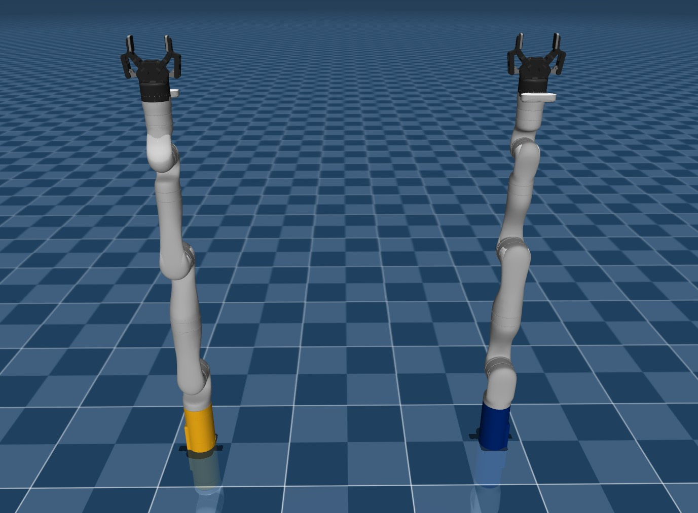
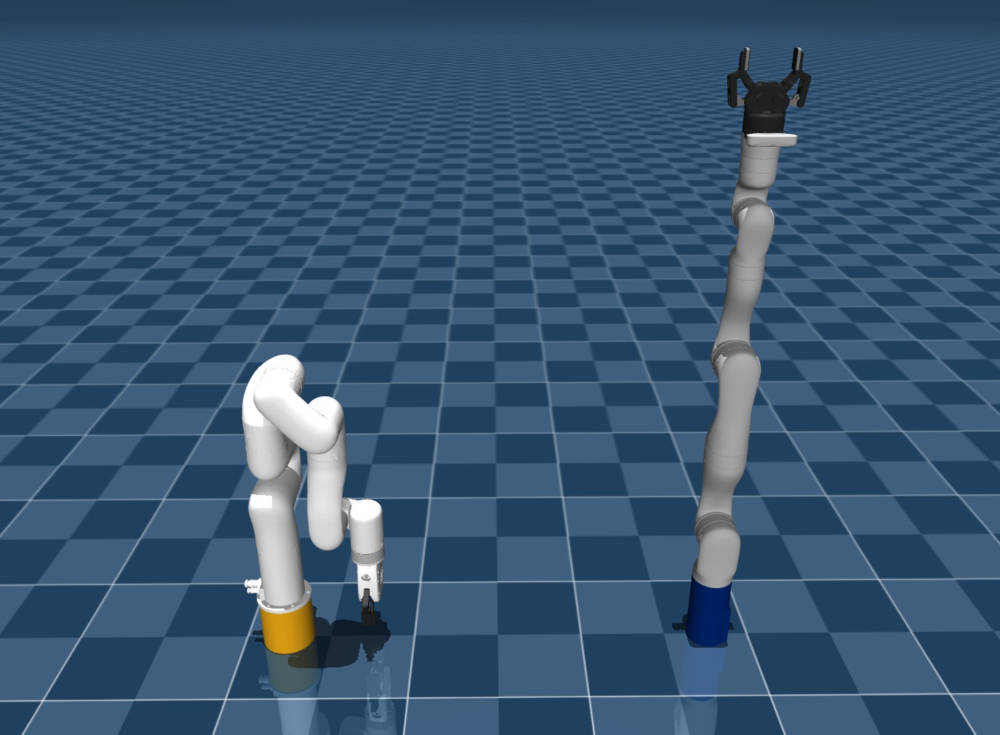
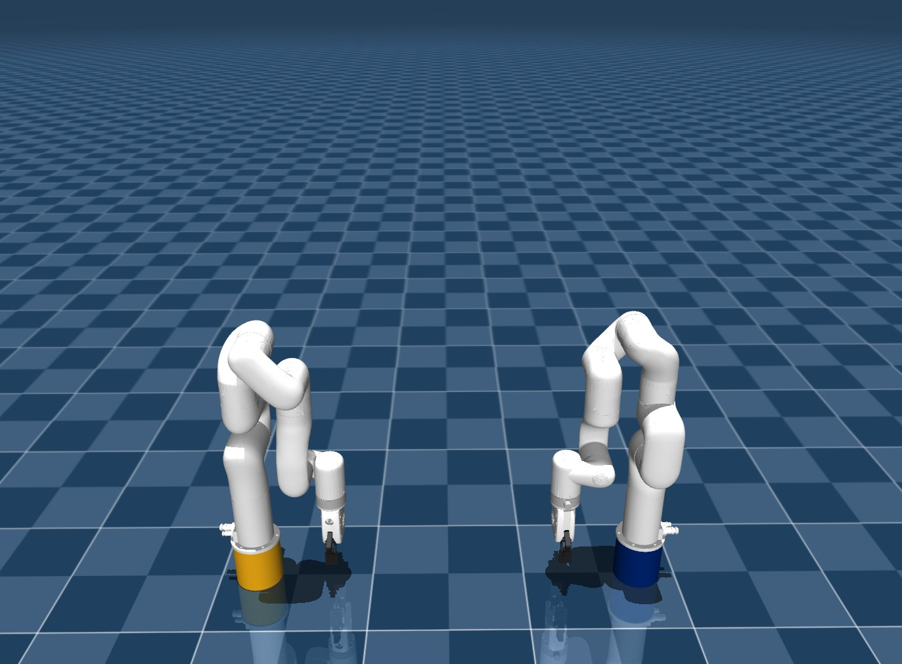

# bimanual-manipulation

High-fidelity mujoco simulator for bimanual manipulation tasks.

## Setup

This repo has been designed to operate with minimal packages, and so installation is as simple as installing the 3 python packages below.

```{bash}
pip install mujoco, numpy, pygame
```

## Description

In this repo we provide three bimanual manipulation setups with different robotic arm configurations. In all scenarios, the first agent, Bob, is denoted by the 7-DOF robotic arm with a california gold base and the second agent, Alice, is denoted by the 7-DOF robotic arm with the blue base.

### Kinova-Kinova Scenario

The first scenario involves two Kinova Gen3 7-DOF robotic arms, as illustrated in the figure below.



### Ufactory-Kinova Scenario

Our second scenario involves both a Ufactory xArm7 7-DOF robotic arm and a Kinova Gen3 7-DOF arm, as illustrated in the figure.



### Ufactory-Ufactory Scenario

Our final scenario involves two Ufactory xArm7 7-DOF robotic arms as illustrated in the figure below.

